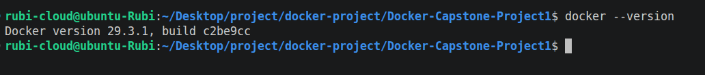
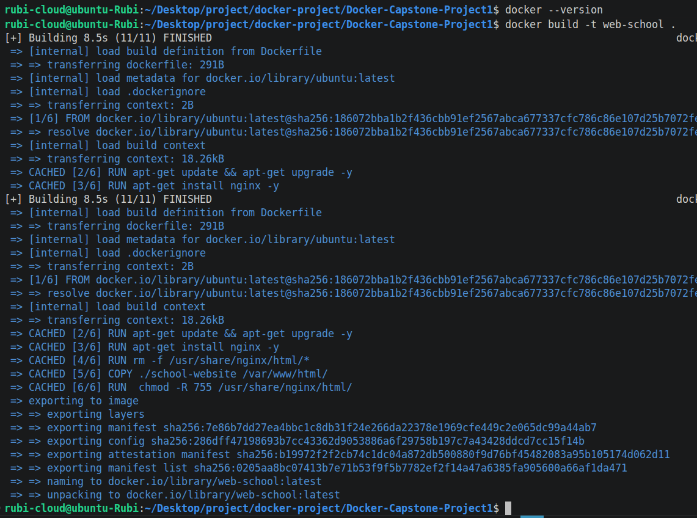
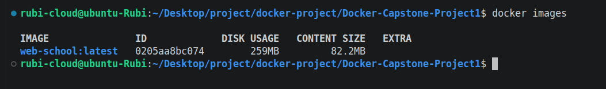
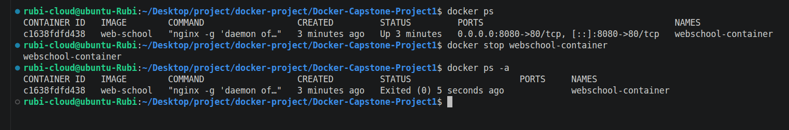
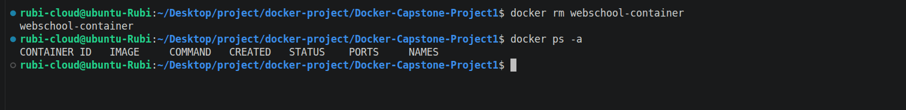
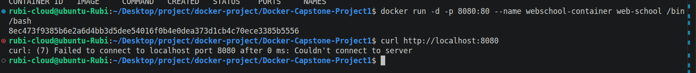
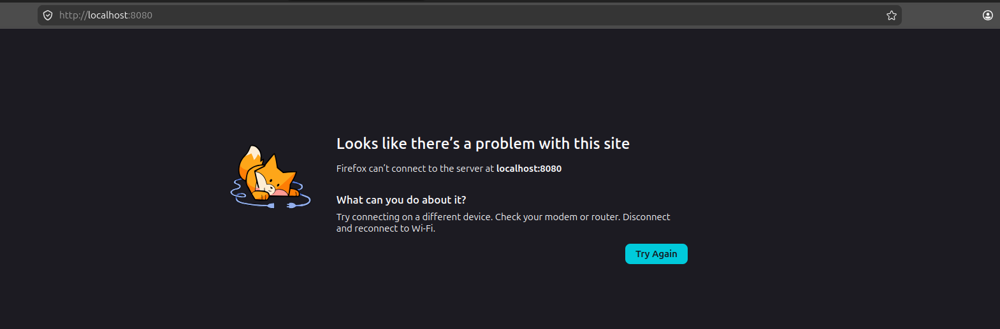

# **TITLE: Containerizing a Static Website with Docker**

## **Project Overview**
This project demonstrate how to containerize and deploy a static website using Docker. It uses a lightweight web server (nginx) to serve static files such as HTML, CSS, and JavaScript


### Project Architecture

.
├── Dockerfile
├── images
├── Readme.md
└── school-website

### Prerequisites

- [x] Make sure you have Docker installed (latest version)
```
    docker --version
```


## **Required Steps**

### step1: Build and Run Containers

    docker build -t web-school .


### step2: verify the image creation

    docker images


### step3: create container from the image

    docker run -d -p 8080:80 --name webschool-container web-school
    docker ps


### step4: open your browser

    open your browser: localhost:8080


### step5: Stop and Remove Container

    docker stop webschool-container 


    docker rm webschool-container 
    docker rm webschool-container -f


### Issue Faced: misconfig, and errors




    The cause of this error is the docker run -d -p 8080:80 web-school /bin/bash, which is overriding or ignoring the content of the Dockerfile and run bash instead.

Run: 

    docker ps -a


```
You will notice under the COMMAND section that /bin/bash is the running command instead of `"nginx", "-g", "daemon off;"`
```
### Solution:

`Do this instead:`

    docker run -d -p 8080:80 --name webschool-container web-school 

NOTE: Don't include /bin/bash in the command


### Definition of Command Used

- [x] docker build -t --> build image from Dockerfile
- [x] docker images   --> list all images
- [x] docker run -d   --> create and start a container as daemon
- [x] docker ps       --> list runnimg containers with their ID's
- [x] docker rm -f    --> force remove ruuning containers
- [x] docker stop     --> stop running container gracefully

### What I Learned

- [x] Build and run containers from images and manage their lifecycle (start, stop, remove)
- [x] Serving static content with Nginx from thr default root directory /usr/share/nginx/html
- [x] Mapping container port to host port(80:80) and how users access services running inside containers.
- [x] Packaging an application with it's dependencies into a portable unit 